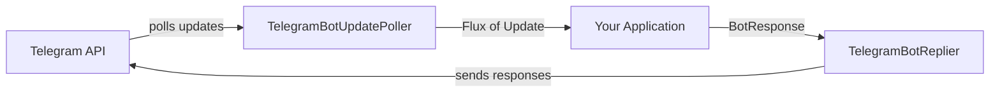

# Telegram Bot Framework

A reactive, modular Java framework for building Telegram bots. Built on Spring WebFlux and Project Reactor with pluggable message queue support.

## Modules

| Module                      | Description                                                        |
|-----------------------------|--------------------------------------------------------------------|
| `telegram-bot-client`       | Reactive HTTP client for the Telegram Bot API                      |
| `telegram-bot-core`         | Shared interfaces: `ReactiveChannel`, `ReadableReactiveChannel`, `WritableReactiveChannel`, `UpdateHandler`, `BotResponse` |
| `telegram-bot-poller`       | Polls updates from Telegram (`TelegramBotUpdatePoller`) and dispatches outbound responses (`TelegramBotReplier`) |
| `telegram-bot-queue-pulsar` | Apache Pulsar implementation of `ReadableReactiveChannel` and `WritableReactiveChannel` using Pulsar Reactive API |

## Architecture



The `TelegramBotUpdatePoller` returns a reactive `Flux<Update>` stream. Your application processes updates and dispatches responses through `TelegramBotReplier`. For distributed architectures, use `ReadableReactiveChannel` and `WritableReactiveChannel` to decouple components via message queues (e.g., Pulsar). Channels are split into readable and writable interfaces following the principle of interface segregation.

## Requirements

- Java 25+
- Gradle 9.1+
- Docker (for Pulsar integration tests)

## Installation

### Gradle (Kotlin DSL)

```kotlin
dependencies {
    // Core client only
    implementation("dev.alimov.telegram-bot:telegram-bot-client:1.4.0-SNAPSHOT")

    // Full framework
    implementation("dev.alimov.telegram-bot:telegram-bot-core:1.4.0-SNAPSHOT")
    implementation("dev.alimov.telegram-bot:telegram-bot-poller:1.4.0-SNAPSHOT")

    // Pulsar queue (optional)
    implementation("dev.alimov.telegram-bot:telegram-bot-queue-pulsar:1.4.0-SNAPSHOT")
}
```

### Maven

```xml

<dependency>
    <groupId>dev.alimov.telegram-bot</groupId>
    <artifactId>telegram-bot-core</artifactId>
    <version>1.4.0-SNAPSHOT</version>
</dependency>
```

## Quick Start

### Standalone client

```java
class Example {
    public void send() {
        TelegramBotClient client = new TelegramBotClient("YOUR_BOT_TOKEN");

        // Send a message
        client.sendMessage(chatId, "Hello!", ParseMode.HTML, null)
              .subscribe(r -> System.out.println("Sent: " + r.getResult().messageId()));

        // Poll for updates
        client.getUpdates(0, 100, 30, List.of("message"))
              .subscribe(update -> System.out.println("Received: " + update.message().text()));
    }
}
```

### Full framework usage

```java
public class Example {
    public void run() {
        TelegramBotClient client = new TelegramBotClient("YOUR_BOT_TOKEN");

        // Create poller and replier
        TelegramBotUpdatePoller poller = new TelegramBotUpdatePoller(
                client, 100, 30, List.of("message", "callback_query"));
        TelegramBotReplier replier = new TelegramBotReplier(client);

        // Subscribe to updates, process them, and dispatch responses
        poller.subscribe()
              .flatMap(update -> {
                  String text = update.message().text();
                  long chatId = update.message().chat().id();
                  BotResponse response = new BotResponse.SendMessage(chatId, "Echo: " + text);
                  return replier.dispatch(response);
              })
              .subscribe();
    }
}
```

## BotResponse Types

The `BotResponse` sealed interface supports all major Telegram Bot API methods:

| Category     | Types                                                                                               |
|--------------|-----------------------------------------------------------------------------------------------------|
| **Text**     | `SendMessage`                                                                                       |
| **Media**    | `SendPhoto`, `SendDocument`, `SendVideo`, `SendAudio`, `SendVoice`, `SendSticker`, `SendMediaGroup` |
| **Location** | `SendLocation`, `SendContact`                                                                       |
| **Actions**  | `SendChatAction`                                                                                    |
| **Edit**     | `EditMessageText`, `EditMessageCaption`, `EditMessageReplyMarkup`                                   |
| **Delete**   | `DeleteMessage`                                                                                     |
| **Forward**  | `ForwardMessage`, `CopyMessage`                                                                     |
| **Callback** | `AnswerCallbackQuery`                                                                               |
| **Payments** | `SendInvoice`, `AnswerPreCheckoutQuery`                                                             |

Each type has convenience constructors for common usage:

```java
// Simple text
new BotResponse.SendMessage(chatId, "Hello!")

// Text with formatting
new BotResponse.SendMessage(chatId, "<b>bold</b>", ParseMode.HTML)

// Photo with caption
new BotResponse.SendPhoto(chatId, "photo_file_id", "Nice shot!", ParseMode.HTML)

// Edit existing message
new BotResponse.EditMessageText(chatId, messageId, "Updated text")

// Delete message
new BotResponse.DeleteMessage(chatId, messageId)

// Answer callback query
new BotResponse.AnswerCallbackQuery(callbackQueryId, "Done!", true)
```

## Running Tests

### Unit tests

```bash
./gradlew test -x telegram-bot-queue-pulsar:test
```

### Integration tests (requires Docker)

Start Pulsar:

```bash
docker compose up -d
```

Run all tests including Pulsar integration:

```bash
./gradlew test
```

Stop Pulsar:

```bash
docker compose down
```

## Building from Source

```bash
git clone https://github.com/alimovalisher/telegram.git
cd telegram
./gradlew build
```

## Publishing

Artifacts are published to Maven Central using the [vanniktech maven-publish](https://github.com/vanniktech/gradle-maven-publish-plugin) plugin.

Configure the following Gradle properties (in `~/.gradle/gradle.properties` or via environment variables):

| Gradle Property             | Environment Variable                           | Description               |
|-----------------------------|------------------------------------------------|---------------------------|
| `mavenCentralUsername`      | `ORG_GRADLE_PROJECT_mavenCentralUsername`      | Maven Central username    |
| `mavenCentralPassword`      | `ORG_GRADLE_PROJECT_mavenCentralPassword`      | Maven Central password    |
| `signing.keyId`             | `ORG_GRADLE_PROJECT_signing.keyId`             | GPG key ID (last 8 chars) |
| `signing.password`          | `ORG_GRADLE_PROJECT_signing.password`          | GPG key passphrase        |
| `signing.secretKeyRingFile` | `ORG_GRADLE_PROJECT_signing.secretKeyRingFile` | Path to GPG keyring file  |

```bash
./gradlew publishAllPublicationsToMavenCentralRepository
```

## Contributing

See [CONTRIBUTING.md](CONTRIBUTING.md) for guidelines.

## License

This project is licensed under the [Apache License 2.0](LICENSE).
